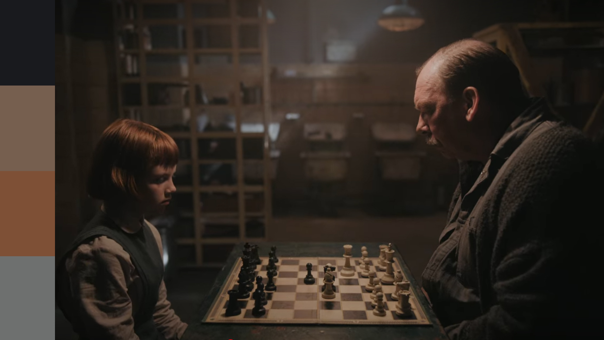
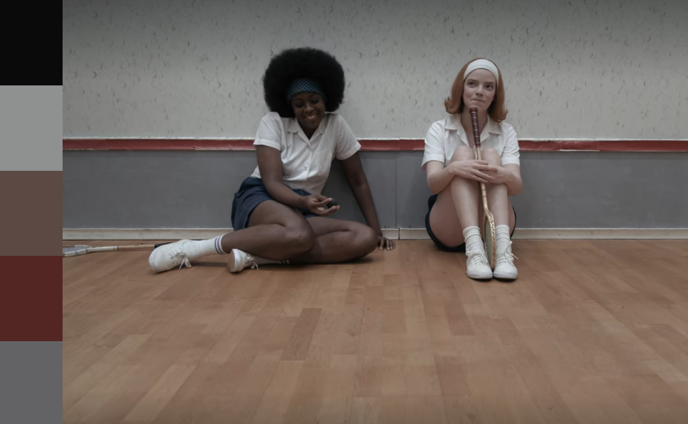

---
output:
  md_document:
    variant: markdown_github
---

<!-- README.md is generated from README.Rmd. Please edit that file -->

```{r, echo = FALSE}
knitr::opts_chunk$set(
  collapse = TRUE,
  comment = "#>",
  fig.path = "figure/",
  fig.height = 1
)
```

# Queens Gambit palettes

Recently, I was blown away by the cinematography and color palettes of the Netflix show "The Queens Gambit", so I made a color palette generated similar to the wesanderson package. Full credit to Karthik Ram and his [Wes Anderson color palette package](https://github.com/karthik/wesanderson) for the code and inspiration.


## Installation

Development version

```r
devtools::install_github("rmvpaeme/queensgambit")
```

## Usage

```{r, palettes_dummy}
library("queensgambit")

# See all palettes
names(qg_palettes)
```

## Palettes

### Openings


```{r, bottlerocket1}
qg_palette("openings")
```

### Adopted


```{r, rushmore}
qg_palette("adopted")
```

### Moscow


```{r, royal}
qg_palette("moscow")
```


### Endgame


```{r, lifeaquatic}
qg_palette("endgame")
```


```{r, volcano, fig.height = 3}
qg_palette("endgame", 21, type = "continuous")
```

### Practice


```{r, darjeeling}
qg_palette("practice")
```

### Room


```{r, chevalier}
qg_palette("room")
```

### Squash



```{r, fantasticfox}
qg_palette("squash")
```

### US open


```{r, moonrise}
qg_palette("USopen")
```

```{r, ggplot1, fig.height = 3}
library("ggplot2")
ggplot(mtcars, aes(factor(cyl), fill=factor(vs))) +  geom_bar() +
  scale_fill_manual(values = qg_palette("USopen")[1:2]) + theme_bw()
```
