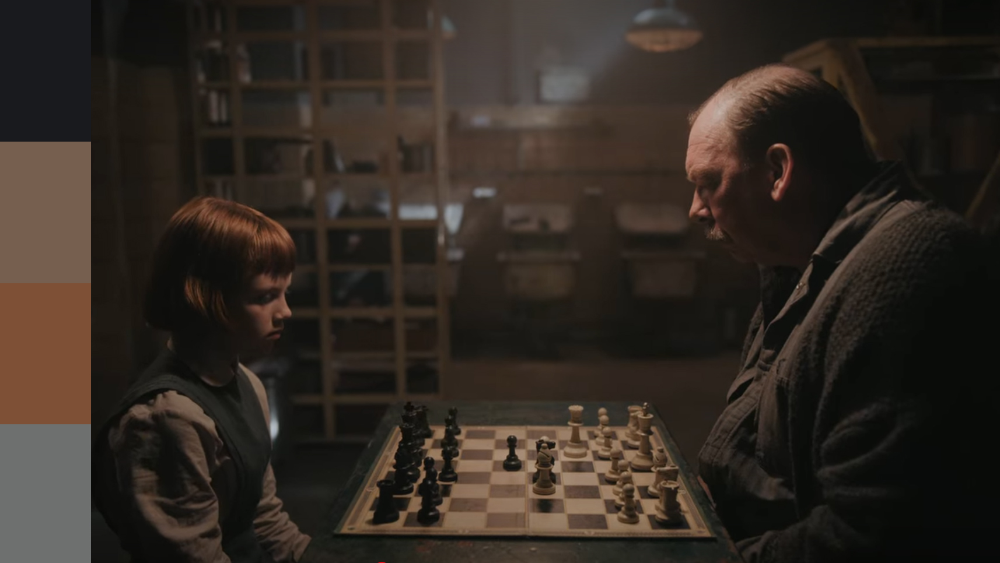
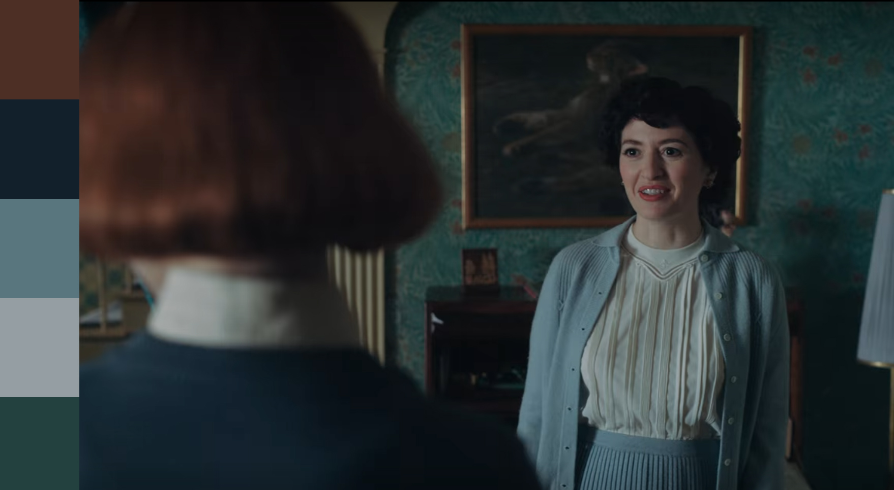
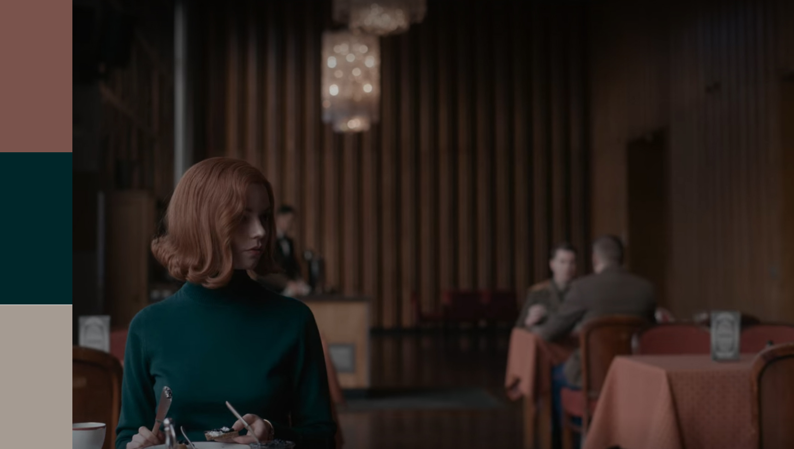
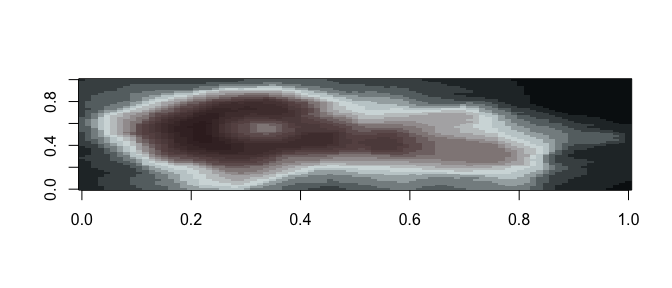
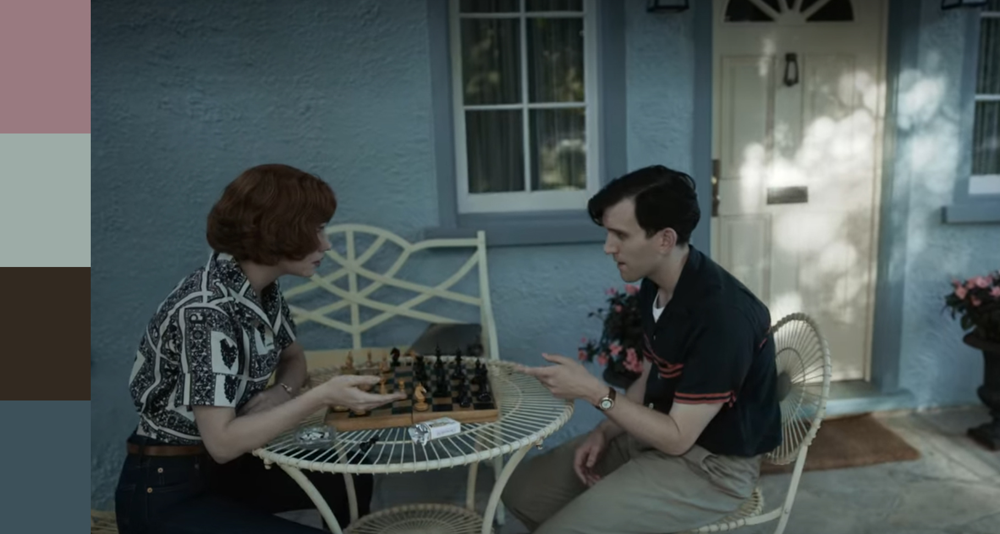
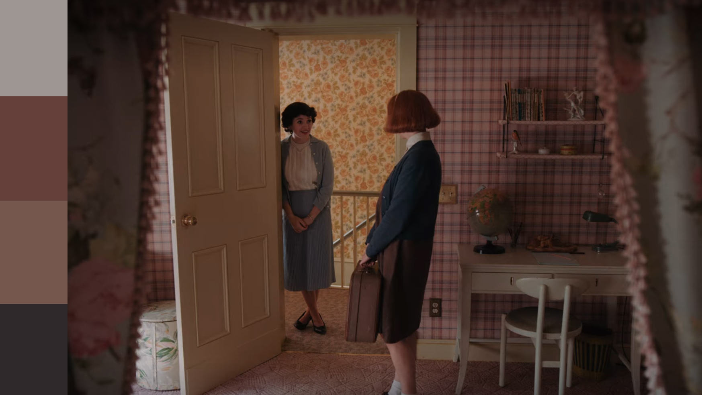
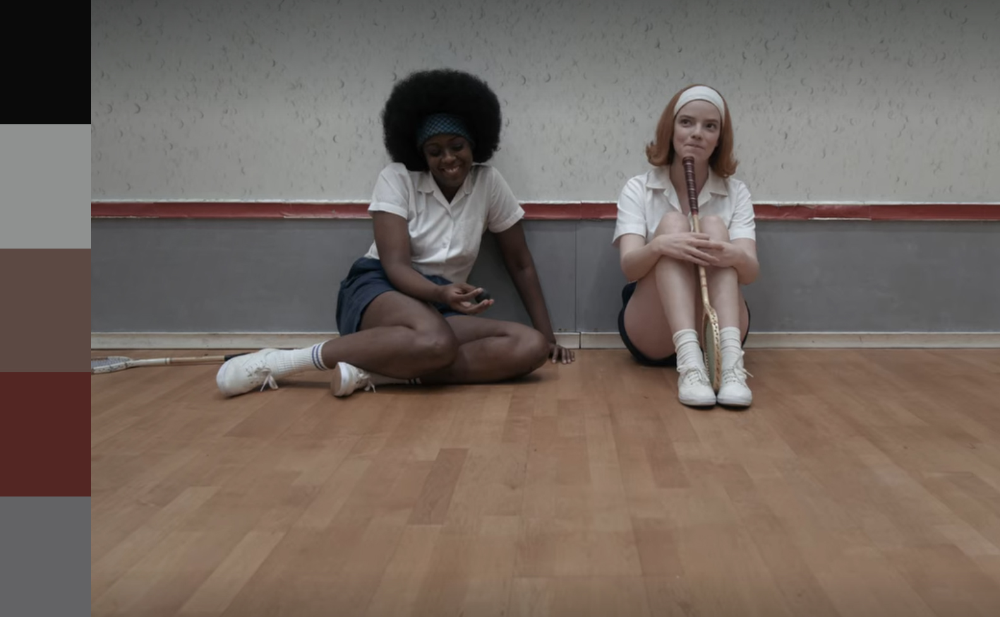
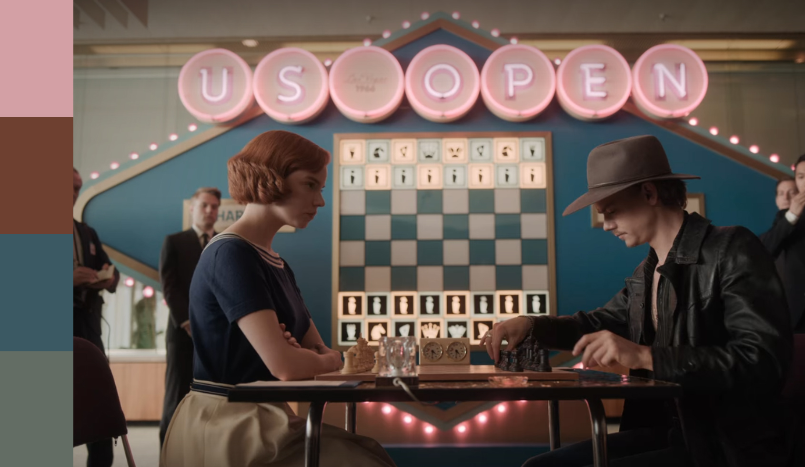
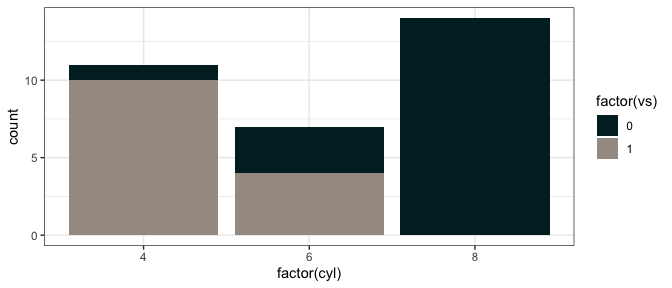

<!-- README.md is generated from README.Rmd. Please edit that file -->

Queens Gambit palettes
======================

Recently, I was blown away by the cinematography and color palettes of
the Netflix show “The Queens Gambit”, so I made a color palette
generated similar to the wesanderson package. Full credit to Karthik Ram
and his [Wes Anderson color palette
package](https://github.com/karthik/wesanderson) for the code and
inspiration.

Installation
------------

Development version

``` r
devtools::install_github("rmvpaeme/queensgambit")
```

Usage
-----

``` r
library("queensgambit")

# See all palettes
names(qg_palettes)
#> [1] "openings" "adopted"  "moscow"   "endgame"  "practice" "room"     "squash"  
#> [8] "USopen"
```

Palettes
--------

### Openings



``` r
qg_palette("openings")
```


### Adopted



``` r
qg_palette("adopted")
```


### Moscow



``` r
qg_palette("moscow")
```


### Endgame


``` r
qg_palette("endgame")
```


``` r
qg_palette("endgame", 21, type = "continuous")
```



### Practice



``` r
qg_palette("practice")
```


### Room



``` r
qg_palette("room")
```


### Squash



``` r
qg_palette("squash")
```


### US open



``` r
qg_palette("USopen")
```


``` r
library("ggplot2")
ggplot(mtcars, aes(factor(cyl), fill=factor(vs))) +  geom_bar() +
  scale_fill_manual(values = qg_palette("USopen")[1:2]) + theme_bw()
```


