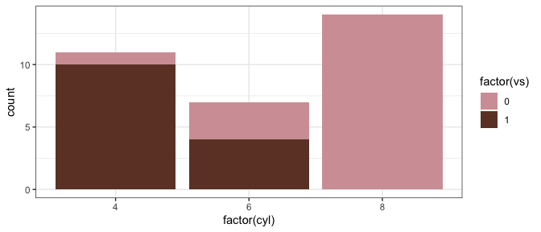

<!-- README.md is generated from README.Rmd. Please edit that file -->

Queens Gambit palettes
======================

I often use the color palettes from the wesanderson R package. Recently,
I was blown away by the cinematography and color palettes of the Netflix
show “The Queens Gambit”, so I made a color palette generated similar to
the wesanderson package.

Installation
------------

Development version

``` r
devtools::install_github("rmvpaeme/queensgambit")
```

Usage
-----

``` r
library("queensgambit")

# See all palettes
names(qg_palettes)
#> [1] "openings" "adopted"  "moscow"   "endgame"  "practice" "room"     "squash"  
#> [8] "USopen"
```

Palettes
--------

### Openings


``` r
qg_palette("openings")
```


### Adopted


``` r
qg_palette("adopted")
```


### Moscow


``` r
qg_palette("moscow")
```


``` r
library("ggplot2")
ggplot(mtcars, aes(factor(cyl), fill=factor(vs))) +  geom_bar() +
  scale_fill_manual(values = qg_palette("moscow")[2:3]) + theme_bw()
```



### Endgame


``` r
qg_palette("endgame")
```


``` r
pal <- qg_palette("endgame", 21, type = "continuous")
image(volcano, col = pal)
```


``` r
pal <- qg_palette("room", 100, type = "continuous")
# heatmap is a local dataset
ggplot(heatmap, aes(x = X2, y = X1, fill = value)) +
  geom_tile() + 
  scale_fill_gradientn(colours = pal) + 
  scale_x_discrete(expand = c(0, 0)) +
  scale_y_discrete(expand = c(0, 0)) + 
  coord_equal() 
```


### Practice


``` r
qg_palette("practice")
```


### Room


``` r
qg_palette("room")
```


### Squash


``` r
qg_palette("squash")
```


### US open


``` r
qg_palette("USopen")
```


